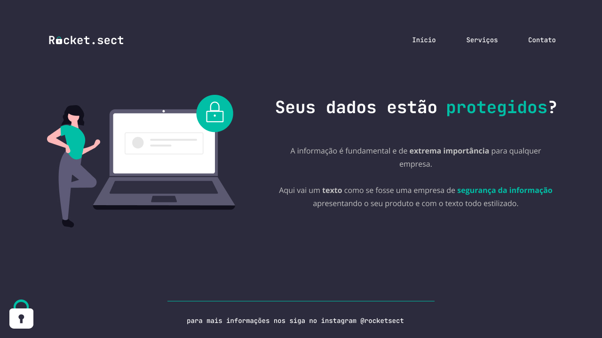

<h1 align="center"> Rocket.sect Project </h1>

Challenge #4 developed at stage 02 of Explorer by Rocketseat.

  <a href="#-tecnologias">Technologies</a>&nbsp;&nbsp;&nbsp;|&nbsp;&nbsp;&nbsp;
  <a href="#-projeto">Project</a>&nbsp;&nbsp;&nbsp;|&nbsp;&nbsp;&nbsp;
  <a href="#-layout">Layout</a>&nbsp;&nbsp;&nbsp;|&nbsp;&nbsp;&nbsp;
  <a href="#memo-licença">License</a>

  

 

  

## 🚀 Technologies

This project was developed with the following technologies:

- HTML
- CSS
- Git and Github
- Figma

## 💻 Project

Rocket.sect project is a website for a fictional data security company where the main purpose is to test the students HTML and CSS skills.

- [Checkout the final project, online](https://douglasshinzato.github.io/layout-rebuild/)

## 🔖 Layout

You can checkout the project layout by [this link](<https://www.figma.com/file/zIKEUFJ5mcaGWN1DsFeLFm/Projeto01-Extra-(Copy)?node-id=0%3A1&t=kej38m3kGD81pdnh-0>). You must have a [Figma](https://figma.com) account to access.

## :memo: License

This project is under MIT license.
